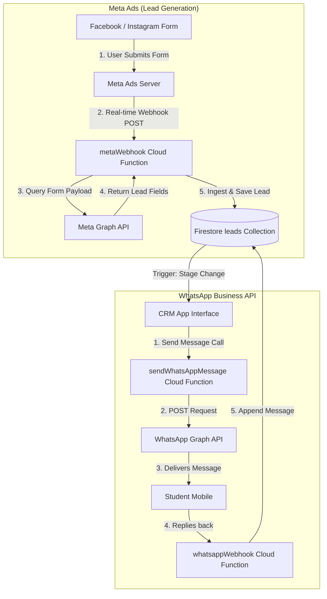

# 🔌 WhatsApp & Meta Ads Integration Reference Guide

This reference guide explains how the **Meta Ads (Facebook/Instagram)** and **WhatsApp Business API** integrations are structured, how they work, and what tech credentials and database schemas they require.

---

## 1. How It Works (Visual Flow)



---

## 2. Integration Architecture Table

| Integration | What It Does | How It Works | Tech Stack & Services | Variables & Credentials Needed | Functions Needed |
| :--- | :--- | :--- | :--- | :--- | :--- |
| **Meta Ads** | Captures Facebook/Instagram ad form inquiries in real-time. | Meta webhooks notify our servers of submissions; backend pulls fields and saves them. | • Firebase Cloud Functions<br>• Meta Graph API<br>• Firestore DB | • `metaAppId`<br>• `metaAppSecret`<br>• `metaPageAccessToken`<br>• `metaVerifyToken` | **2 Functions:**<br>1. `metaWebhook` (Ingests data)<br>2. `metaWebhookVerify` (Authenticates link) |
| **WhatsApp API** | Sends automated stage templates (Demo, Enrolled) & live chat. | App calls WhatsApp endpoint to send; webhook handles incoming replies. | • Firebase Cloud Functions<br>• Meta Graph API<br>• Axios client | • `whatsappPhoneNumberId`<br>• `whatsappAccountId`<br>• `whatsappSystemToken`<br>• `whatsappVerifyToken` | **2 Functions:**<br>1. `sendWhatsAppMessage` (Sends)<br>2. `whatsappWebhook` (Receives replies) |

---

## 3. Database Schema Blueprint

Settings and integration credentials are stored securely in a single Firestore document under the `/settings` collection.

### Collection: `/settings` ➜ Document: `integrations`
```json
{
  "meta": {
    "enabled": true,
    "status": "Connected",
    "appId": "123456789012345",
    "appSecret": "encrypted_app_secret_hash",
    "pageAccessToken": "encrypted_page_access_token",
    "webhookVerifyToken": "random_secure_verify_token_here",
    "lastSyncedAt": "2026-06-13T12:00:00.000Z"
  },
  "whatsapp": {
    "enabled": true,
    "status": "Connected",
    "phoneNumberId": "987654321098765",
    "businessAccountId": "564738291029384",
    "systemToken": "encrypted_permanent_system_user_token",
    "webhookVerifyToken": "random_secure_verify_token_here",
    "apiVersion": "v20.0"
  }
}
```

### Collection: `/leads` ➜ Document: `lead_id` (Chat Messages)
WhatsApp chat messages are appended dynamically to each lead profile document:
```json
{
  "id": "lead-101",
  "name": "Aarav Sharma",
  "phone": "+919876543210",
  "whatsappMessages": [
    {
      "id": "msg-001",
      "sender": "counselor",
      "text": "Hello Aarav! Welcome to TechZone Academy.",
      "time": "10:00 AM"
    },
    {
      "id": "msg-002",
      "sender": "lead",
      "text": "Hi, I want details on the Full Stack course.",
      "time": "10:05 AM"
    }
  ]
}
```

---

## 4. How to Set It Up (Simple Steps)

1. **Configure Meta Developer Portal**:
   * Create a Meta Developer App ➜ Add **Webhooks** (Meta Page / WhatsApp Business Account).
   * Point Webhook URLs to:
     * `https://[your-region]-[your-project].cloudfunctions.net/metaWebhook`
     * `https://[your-region]-[your-project].cloudfunctions.net/whatsappWebhook`
2. **Setup Credentials in CRM**:
   * Open the Integrations console in the CRM ➜ Paste token keys ➜ Save.
3. **Verify webhooks**:
   * Submit a mock test form from the Meta Ads Lead Ads Testing Tool to verify instant sync in the CRM database.
