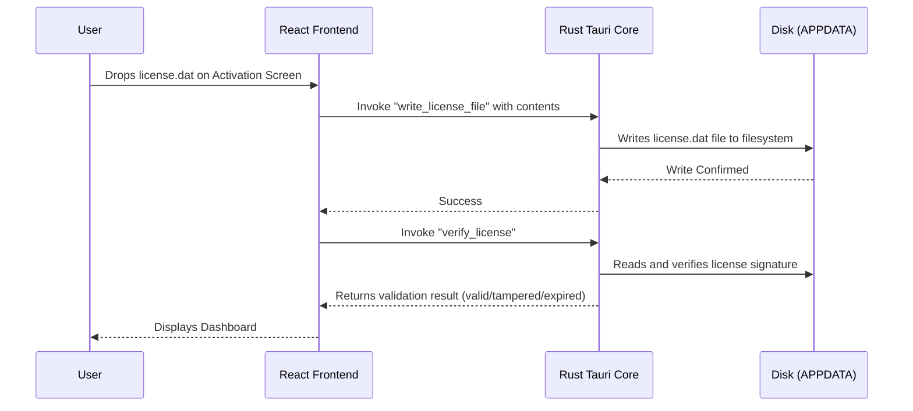

# Advanced Software Licensing & Security Architecture Proposal

This proposal details the architectural changes required to resolve the `localStorage` license bypass loophole and introduces a comprehensive multi-layered security blueprint to harden the TechZone Academy Lead Management desktop application against patching, licensing bypasses, and reverse engineering.

---

## 🔍 Root Cause Analysis: The `localStorage` Caching Bypass

Currently, the application checks for the license using the following logic in `src/App.jsx`:

```javascript
const runLicenseVerification = async () => {
  setCheckingLicense(true);
  let localLicense = localStorage.getItem('crm_license_file');

  // Tauri AppData Check: Only runs if localLicense is NOT in localStorage
  if (!localLicense && window.__TAURI__) {
    // Reads from file...
  }
}
```

### Why this is a security risk:
1. **Out of Sync with Filesystem:** Once a valid license is loaded, it is saved in browser memory (`localStorage`). If the user later modifies, deletes, or corrupts the physical `license.dat` file inside their `%APPDATA%` directory, the app continues to run perfectly because it reads the cached version.
2. **Easy Manipulation:** Web storage cache is easily editable or inspectable. A user can open developer tools, edit the cached JSON object, and bypass verification checks if the validation functions are client-side.
3. **Bypass Persistence:** The application only performs disk-level verification when `localStorage` is cleared.

---

## 🛠️ Phase 1 Fix: Enforcing Strict Disk-Level Verification [STATUS: IMPLEMENTED]

To close this loophole, we updated the licensing flow so that the application is forced to read and cryptographically verify the physical file on the disk on **every startup**. 

### 1. Removing the Caching Mechanism
We updated `runLicenseVerification` in [App.jsx](file:///c:/Users/mohda/OneDrive/Desktop/tz-lead-management/src/App.jsx) to completely bypass `localStorage` checks:
- The app invokes the Rust command `verify_license` directly.
- The React state only holds the license parameters in-memory (variables) during runtime, never storing the raw JSON string in permanent browser storage.

### 2. Disk Synchronization on Activation
Since `localStorage` is no longer used for validation, dropping a license file on the activation screen writes the file directly to the computer's hard drive:
- We added a new Tauri Rust command: `write_license_file(contents: String)`.
- When a user drops a new license onto the UI, the frontend calls this Rust command, saving it directly to `%APPDATA%/com.tz.leadmanagement/license.dat`.
- The app then reloads the verification routine directly from the disk.



---

## 🛡️ The 5-Layer Security Blueprint

To ensure that the application is protected against advanced bypass techniques, we have planned and partially implemented the following 5 security layers.

### 🔒 Level 1: Compiled Rust-Level Verification [STATUS: IMPLEMENTED]
* **Vulnerability:** Performing cryptographic checks in JavaScript is vulnerable to browser console exploitation. Attackers can override JavaScript functions (e.g., rewriting `verifySoftwareLicense` to always return `true`).
* **Implementation:**
  - We migrated the RSA-2048 signature verification logic from JavaScript into native **Rust** (`src-tauri/src/lib.rs`) using the `rsa`, `sha2`, and `base64` Rust crates.
  - The public key is compiled directly inside the native binary.
  - When React boots, it calls:
    ```javascript
    const result = await invoke('verify_license', { currentProjectId });
    ```
  - **Why it works:** Rust compiles to native machine code. It cannot be edited like raw JS files, making it extremely difficult for non-technical users or crackers to patch the check.

---

### 💻 Level 2: Machine ID / Hardware Lock [STATUS: IMPLEMENTED]
* **Vulnerability:** Currently, if a client obtains a single valid license file (e.g., `license.dat` signed for `TechZone Academy`), they can distribute that file to 100 different computers, and it will run successfully on all of them.
* **Implementation:**
  - We implemented a Rust command to fetch unique hardware values from the workstation:
    - **Windows:** Motherboard/Registry GUID (`MachineGuid` from `HKEY_LOCAL_MACHINE\SOFTWARE\Microsoft\Cryptography`).
  - During license generation, the administrator includes the target machine's Machine ID in the license payload.
  - **Verification:**
    - On startup, the Rust backend retrieves the local Machine ID and compares it to the one signed in the license.
    - If they do not match, the verification result returns `hardware_mismatch` and locks the app.
  - **Why it works:** A license generated for Computer A will immediately fail signature and verification checks if copied onto Computer B.

---

### 🕵️ Level 3: JS Obfuscation & DevTools Lockout [STATUS: PROPOSED / READY TO IMPLEMENT]
* **Vulnerability:** If developer tools are accessible, an attacker can simply open the console and call internal functions, inspect state, or modify local variables to bypass route restrictions.
* **Implementation:**
  - **Obfuscation:** We will integrate `vite-plugin-javascript-obfuscator` into our build system. This transforms readable files into complex, self-defending, obfuscated code.
  - **Disabling DevTools:** In `src-tauri/tauri.conf.json`, we will disable debugging utilities in production:
    ```json
    "windows": [
      {
        "devtools": false
      }
    ]
    ```
  - **Keyboard Intercepts:** Add DOM listeners to block shortcut keys such as `F12`, `Ctrl+Shift+I`, `Ctrl+Shift+C`, and prevent right-clicks (context menu).
  - **Why it works:** It prevents users from inspecting variables, altering app execution flow, or extracting raw code files from the bundle.

---

### 🕰️ Level 4: Encrypted Local Run-Time State [STATUS: PROPOSED / READY TO IMPLEMENT]
* **Vulnerability:** To bypass a trial expiration, a user can disconnect their internet connection and roll back their Windows system clock.
* **Implementation:**
  - We already inspect Firestore records to check if the clock has been set backward, but we want an offline safeguard.
  - On every application startup and during database operations, the app writes the current date/time to a hidden, encrypted configuration file on the disk (e.g., `%APPDATA%/com.tz.leadmanagement/state.bin`).
  - The content is encrypted using AES-GCM (via Rust) so it cannot be read as plain text.
  - If the computer's system time is ever earlier than the time saved in this file, the app flags a **Clock Rollback** lockout and restricts operations.
  - **Why it works:** Clearing the browser cache does not affect this hidden state file, ensuring rollback protection remains intact.

---

### 🗄️ Level 5: Firebase Project Locking [STATUS: IMPLEMENTED]
* **Vulnerability:** A customer could potentially point their local application to a different Firestore database instance, hijacking resources or accessing sandboxes they shouldn't.
* **Implementation:**
  - The Rust backend reads the active Firebase Project ID dynamically and verifies it against the `firebaseProjectId` sealed inside the signed license file.
  - If the project IDs do not match, the verification fails with `id_mismatch`, blocking access to the frontend.
  - **Why it works:** Enforces data isolation and guarantees that a license is restricted to a specific Firebase backend.

---

## 🔒 Threat Matrix & Attack Mitigation

| Attack Scenario | Vulnerability in Basic Setup | How Advanced Security Blocks It | Result Shown to User |
| :--- | :--- | :--- | :--- |
| **Editing the Expiry Date** | The user edits `license.dat` using Notepad to extend dates. | RSA-2048 verification fails because the signature no longer matches the payload. | **Invalid Signature Error** (Lockout screen) |
| **Sharing the License File** | The license file is copied and shared with other clinics/users. | Level 2 compares the local Machine ID with the license payload. | **Hardware Mismatch Error** (Lockout screen) |
| **Bypassing JS Checks** | A user overrides the React verification function in the console. | DevTools are disabled, and JavaScript is obfuscated. Check logic runs in Rust. | Cannot open console / Unreadable source code. |
| **Clock Rollback (Offline)** | User rolls back system clock by 1 month to extend trial offline. | Level 4 checks the local encrypted history state file on disk. | **System Date Discrepancy** (Lockout screen) |
| **Tampering with Local Cache** | User clears `localStorage` to reset validation states. | Level 1 forces file read directly from disk on startup; no cache dependency. | Normal file verification occurs immediately. |

---

## 📈 Implementation Roadmap & Progress Status

- [x] **Phase 1 Fix:** Enforce strict physical disk reads on every boot (bypass `localStorage` checks).
- [x] **Level 1 Security:** Migrate RSA-2048 signature verification and trial expiry checks to native compiled Rust core.
- [x] **Level 2 Security:** Retrieve unique system `MachineGuid` and implement optional Workstation ID locking to prevent duplicate installations.
- [x] **Level 5 Security:** Enforce dynamic Firebase Project ID locking to prevent cross-database access.
- [ ] **Level 3 Security (Pending):** Disable production DevTools context in Tauri config and implement Vite JS obfuscation.
- [ ] **Level 4 Security (Pending):** Create local AES-GCM encrypted runtime state file to detect system clock rollbacks offline.
