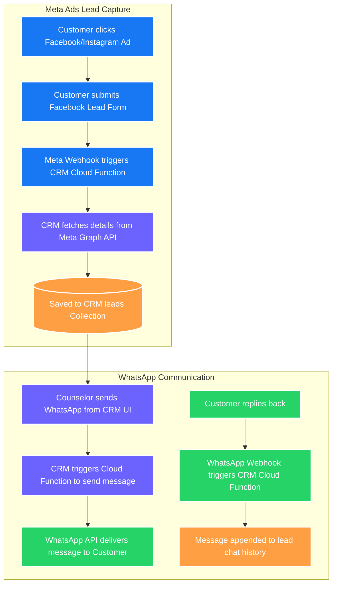

# 📲 WhatsApp & Meta Integration Explainer

This document outlines the **WhatsApp Business API** and **Meta Lead Ads** integrations for the CRM. It explains **what** we do, **how** we do it, the **tech stack**, and the **database/function structures** required in a simple, visual, and short format.

---

## 1. Visual Flow (How Data Moves)



---

## 2. Integration Architecture Table

| Component | What We Do | How We Do It | Tech Stack | Key Variables & Credentials | Functions Needed |
| :--- | :--- | :--- | :--- | :--- | :--- |
| **Meta Ads Integration** | Capture lead details from Facebook/Instagram ads in real time. | 1. Meta triggers webhook on lead submission.<br>2. Cloud Function fetches lead details via Graph API.<br>3. Saves lead directly to Firestore. | • Meta Graph API<br>• Cloud Functions<br>• Firestore DB | • `metaPageAccessToken`<br>• `metaAppSecret`<br>• `metaVerifyToken` | **2 Functions:**<br>• `handleMetaWebhook` (Receive payload)<br>• `verifyMetaWebhook` (Setup handshake) |
| **WhatsApp Integration** | Send automated/manual templates and chat messages to leads. | 1. CRM posts template message payload to WhatsApp API.<br>2. WhatsApp Webhook captures user replies and updates CRM UI. | • WhatsApp Cloud API<br>• Axios (HTTP client)<br>• Firestore DB | • `whatsappPhoneNumberId`<br>• `whatsappSystemToken`<br>• `whatsappVerifyToken` | **2 Functions:**<br>• `sendWhatsApp` (Send messages)<br>• `handleWhatsAppWebhook` (Receive replies) |

---

## 3. Database Schema Blueprint (Keep it Simple)

To run this, we only need to create/update **2 Schemas** in Firestore:

### Schema 1: Credentials Setup (`/settings/integrations`)
Stores tokens and credentials to authenticate API calls.
```json
{
  "meta": {
    "pageAccessToken": "EAAG...",
    "appSecret": "a1b2c3d4...",
    "verifyToken": "mySecureToken123"
  },
  "whatsapp": {
    "phoneNumberId": "10987654321",
    "systemToken": "EAAY...",
    "verifyToken": "mySecureToken456"
  }
}
```

### Schema 2: Chat & Lead Setup (`/leads/{leadId}`)
Every lead document will have a simple array to store chat history dynamically.
```json
{
  "id": "lead_987",
  "name": "Jane Doe",
  "phone": "+919999999999",
  "whatsappMessages": [
    {
      "sender": "counselor",
      "text": "Hi Jane, did you register for the course?",
      "timestamp": "2026-06-13T10:00:00Z"
    },
    {
      "sender": "lead",
      "text": "Yes, I am interested in Full Stack Development.",
      "timestamp": "2026-06-13T10:05:00Z"
    }
  ]
}
```

---

## 4. Setup Checklist (4 Quick Steps)

1. **Meta App Setup**: Create a Meta Developer App, add **Webhooks** and **WhatsApp** product.
2. **Webhook URL registration**: Point webhooks to our Firebase Cloud Functions URL.
3. **Copy Tokens**: Add the API Access Tokens into the CRM Settings panel.
4. **Test**: Submit a mock lead via Meta Developer tools or send a test WhatsApp message to verify the flow!
